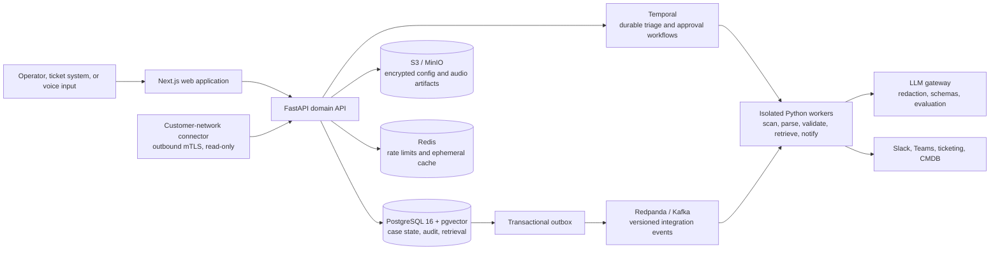

# NetOps Copilot — Production Architecture

## Status and product boundary

This document is the target architecture for the real product. The root-level static HTML prototype is **not** the application and must not be extended or deployed. It can be removed once the `apps/web` product shell has replaced it.

V1 is an evidence-first, read-only advisory product: it ingests incidents and artifacts, runs deterministic validation, drafts a remediating diff, routes the work, and learns only from human-verified resolutions. It does **not** write to network devices. Device execution is a separately scoped future capability with its own approval and policy model.

## Architecture decision

Build a TypeScript/Python modular monolith with separate worker processes. Keep PostgreSQL as the source of truth and extract services only when measured scale or team ownership warrants it.



### Why this shape

- **PostgreSQL + pgvector** keeps tenant policy, evidence, exact search, embeddings, and transactional history together at the scale of the first product.
- **Temporal** owns long-running work, retries, and multi-day human approval waits. Redis and web-process background tasks never own incident state.
- **Transactional outbox + idempotent consumers** prevents lost or duplicate integration events.
- **Workers run parsers and validators without network egress**, preserving the deterministic trust boundary.
- **The LLM is an adviser, not an authority.** It can receive redacted evidence and return a schema-validated analysis; it cannot alter state, send notifications, or contact a device.

## Technology baseline

| Concern | Development | Production |
| --- | --- | --- |
| Web | Next.js App Router, React, TypeScript, Tailwind, Radix, TanStack Query | Container behind CDN/WAF; enterprise OIDC session boundary |
| API | Python 3.12, FastAPI, Pydantic v2, SQLAlchemy 2 async, Alembic | Horizontally scaled stateless service |
| Workflow | Temporal Server + UI | Temporal Cloud unless an SRE team owns self-hosting |
| Case and memory store | PostgreSQL 16, pgvector, `tsvector`, `pgcrypto` | Managed multi-AZ PostgreSQL with PITR and tested RLS |
| Artifact store | MinIO | S3 with SSE-KMS, versioning, malware scan, lifecycle rules |
| Eventing | Redpanda in Compose | Managed Kafka/Redpanda only when integrations need replayable events |
| AuthN/AuthZ | Keycloak dev realm, OIDC | Existing Entra ID/Okta/Auth0-compatible enterprise IdP |
| Observability | OpenTelemetry Collector, Prometheus, Grafana, Loki, Tempo | Managed equivalent, alerting and redacted Sentry errors |
| Infrastructure | Docker Compose, Testcontainers | Terraform/OpenTofu; ECS Fargate first, Kubernetes only when justified |
| AI gateway | OpenAI Python SDK behind a provider adapter | Tenant budgets, redaction, prompt/model registry, evaluation gates |

## Trust and authorization boundaries

Every organization-owned row includes `organization_id`; PostgreSQL Row-Level Security is enabled and application authorization is applied as a second barrier. The authenticated principal, not a client-supplied tenant value, sets the database tenant context.

Roles are `org_admin`, `operator`, `approver`, `auditor`, `integration_admin`, and `platform_admin`. Asset ownership/environment policy additionally controls access. Frontend permissions only shape the interface; the API and database make the authorization decision.

Raw audio and config files are encrypted artifacts in object storage. Before embedding or a model call, a worker produces a policy-governed redacted derivative. Redaction targets pre-shared keys, passwords, private keys, SNMP communities, bearer tokens, and API keys. Raw configuration, IP addresses, audio, and ticket text never appear in metrics labels or traces.

## Domain model

The system stores current state and immutable history separately.

| Group | Tables | Notes |
| --- | --- | --- |
| Identity | `organizations`, `users`, `memberships`, `assets`, `asset_owners` | OIDC subject and scoped RBAC |
| Case spine | `cases`, `case_inputs`, `case_events`, `case_transitions`, `analysis_runs` | `cases` is the materialized current view; history is append-only |
| Artifacts | `artifacts`, `config_snapshots`, `parse_runs` | Object keys, hashes, parser version, line-preserving normalized IR |
| Evidence | `validator_runs`, `validator_results`, `finding_evidence`, `diagnoses`, `diagnosis_evidence`, `fix_proposals` | Every claim must point to immutable evidence IDs |
| Learning | `resolutions`, `knowledge_items`, `knowledge_chunks`, `embeddings`, `memory_links` | Only redacted, verified material is eligible for retrieval |
| Operations | `routing_rules`, `notification_deliveries`, `outbox_events`, `consumer_inbox`, `audit_events` | Auditable and retry-safe external action delivery |

Use UUIDv7 IDs, UTC timestamps, immutable content hashes, soft deletion where needed, and a `version` integer on mutable case projections. Write endpoints use an idempotency key; state changes require `expected_version` optimistic locking.

## State machine

```text
new → investigating → diagnosed → fix_proposed → confirmed → resolved → learned
                     ↘ needs_information ───────────────────────┘
```

`confirmed` is always an authorized human action. `learned` means the verified resolution was redacted, chunked, embedded, and linked successfully—not merely that a user clicked a client-side switch. A domain service validates transitions, writes `case_transitions` and `outbox_events` in one transaction, and records the actor and correlation ID.

## Triage workflow

`TriageCaseWorkflow(case_id, analysis_run_id)` is a Temporal workflow with idempotent activities and bounded exponential retry for transient services.

1. Create an immutable analysis run and transition the case to `investigating`.
2. Virus/MIME/size-check uploads. For audio, persist an encrypted artifact and create an authoritative transcript.
3. Redact sensitive data; only the derivative may leave the trust boundary.
4. In parallel, parse Cisco IOS input, classify the normalized incident, and retrieve scoped case context.
5. Run pure validators against the typed parser IR. Add peer/config/RIB context where available.
6. Run hybrid retrieval: pgvector semantic candidates plus PostgreSQL full-text search, fused and filtered by organization, permission, asset, and verified-resolution state.
7. Ask the AI gateway for a strict structured diagnosis grounded only in supplied validator evidence and selected memory excerpts.
8. Generate a structured edit plan. Render a unified diff server-side, reparse it, and rerun validators. Do not present an automatically safe fix if it does not parse or worsens findings.
9. Persist diagnosis, proposal, evidence links, and deterministic routing; enqueue notification through the outbox.
10. Wait for an approval/rejection/needs-information signal. After human confirmation and recorded verification, create a redacted knowledge item and transition to `learned`.

## Parser and validator contract

Start with Cisco IOS. The line-preserving parser makes a typed intermediate representation, then validators are pure functions over that IR.

```text
raw configuration → tokenizer(line + indentation) → block parser → CiscoIosConfig IR → ValidatorResult[]
```

`ValidatorResult` includes: `rule_id`, `rule_version`, status (`pass`, `fail`, `warn`, `not_applicable`, `insufficient_context`), severity, exact source lines, observed/expected values, prerequisites, and an operator-readable explanation.

Build order:

1. IPsec: IKEv1/v2 proposals, transform sets, crypto maps, PFS/DH, SA lifetime, peer/proposal intersection.
2. BGP: remote AS, neighbor/address-family configuration, update-source and route-map attachment. Do not infer topology or next-hop behavior without RIB/policy context.
3. GRE: tunnel source/destination, resolved source address, MTU/MSS accounting, and keepalive comparison only when peer data exists.

Every rule requires golden fixtures covering compatible, incompatible, inherited/override, malformed, and insufficient-context cases. The worker must have no LLM or network dependency.

## AI and retrieval contract

The provider adapter owns all OpenAI use. The API/worker never scatter model IDs or prompts across domain code.

- Use the **Responses API** with strict structured schemas for classification, diagnosis, and edit plans. Enable `store=False` when policy requires no provider-side retention of customer configuration.
- Use `gpt-4o-transcribe` through the audio transcriptions API for operator-submitted voice recordings; a human reviews the transcript before triage.
- Use redacted content with `text-embedding-3-small` initially; promote to a evaluated larger configuration only if relevance metrics justify it. Store the selected embedding dimension consistently with pgvector.
- Read-only tools only: `get_case_context`, `get_validator_results`, `search_memory`. The backend validates arguments, scopes data, and persists all tool/response metadata.
- The diagnosis schema contains a bounded confidence, evidence IDs, unknowns, risk, and proposed edit plan. The API rejects uncited claims or plans that cannot parse/revalidate.

OpenAI references: [Responses function calling](https://developers.openai.com/api/docs/guides/function-calling?api-mode=responses), [speech to text](https://developers.openai.com/api/docs/guides/speech-to-text), and [embeddings](https://developers.openai.com/api/docs/guides/embeddings).

## API and events

All API routes are `/v1`; OpenAPI is generated by FastAPI and consumed as typed clients by the web app.

```text
POST  /v1/cases                                    # create case / idempotency key
GET   /v1/cases?state=&category=&asset_id=&cursor= # paginated queue
GET   /v1/cases/{case_id}                          # workbench projection
GET   /v1/cases/{case_id}/timeline
POST  /v1/cases/{case_id}/artifacts                # signed upload intent
POST  /v1/cases/{case_id}/triage                   # starts/retries analysis, 202
GET   /v1/cases/{case_id}/validator-results
GET   /v1/cases/{case_id}/memory-matches
GET   /v1/cases/{case_id}/fix-proposal
POST  /v1/cases/{case_id}/transition               # expected_version required
POST  /v1/cases/{case_id}/confirm-fix
POST  /v1/cases/{case_id}/resolution
POST  /v1/cases/{case_id}/feedback
GET   /v1/events?after={event_id}                  # authenticated SSE / backfill
POST  /v1/webhooks/{provider}                      # signature-validated input
```

Persist events before stream delivery. Event types include `case.created.v1`, `config.parsed.v1`, `validation.completed.v1`, `analysis.completed.v1`, `recommendation.proposed.v1`, `approval.granted.v1`, `memory.indexed.v1`, and `notification.requested.v1`.

## Repository target

```text
netops-copilot/
├── apps/web/                     # Next.js application
├── services/api/                  # FastAPI package and Alembic migrations
├── services/worker/               # Temporal worker and outbox publisher
├── services/connector-agent/      # outbound-mTLS private-network collector
├── packages/api-client/           # generated OpenAPI TypeScript client
├── infra/                         # Compose, Terraform, dashboards, Helm if later needed
├── tests/                         # unit, fixtures, integration, workflow, contract, security, evals
└── docs/                          # ADRs, rulebook, runbooks, data classification
```

## Operational controls

- OIDC authorization-code flow with PKCE, short-lived API credentials, workload identity for services, and secrets in a managed secrets store.
- Signed upload URLs, file scanning, data classification, configurable retention, KMS encryption, and tested DB/object backups.
- OpenTelemetry traces from API → workflow → worker → notification, with no raw content in telemetry. Alert on workflow retry/failure, outbox age, queue lag, parser failures, retrieval latency, cost, approval age, and connector health.
- CI gates: formatting/lint/type checks, migrations, fixture and property tests, RLS adversarial tests, workflow replay tests, OpenAPI contract snapshots, secret redaction tests, dependency/container scanning, and model/retrieval evaluation thresholds.
